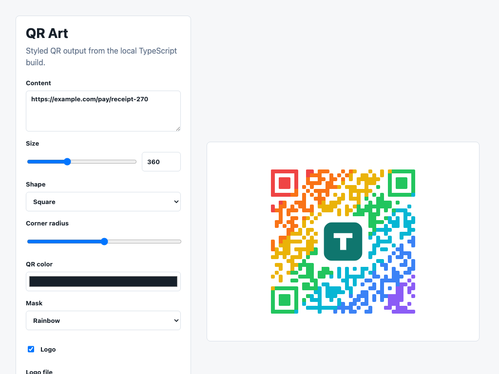

# QR Art

Styled QR code generation for browsers and Node.js.

Rounded square modules keep shared internal joins filled, so only the exposed outside contour gets rounded.
Logo frames clear any QR modules that touch them, and browser users can convert a flat white logo background into transparency before rendering.



## Installation

```bash
pnpm add @unlikeotherai/qr-art
```

Other package managers:

```bash
npm install @unlikeotherai/qr-art
yarn add @unlikeotherai/qr-art
bun add @unlikeotherai/qr-art
```

## Usage

```ts
import { makeLogoBackgroundTransparent, renderSVG } from "@unlikeotherai/qr-art";

const logo = await makeLogoBackgroundTransparent(file, {
  color: "#ffffff",
  tolerance: 48,
});

const svg = renderSVG("https://example.com", {
  size: 512,
  shape: "square",
  cornerRadius: 0.3,
  mask: { preset: "rainbow" },
  logo: {
    src: logo,
    overlay: true,
    sizeRatio: 0.22,
    padding: 10,
    borderRadius: 16,
  },
});
```

## Scripts

- `pnpm build` creates ESM, CommonJS, and type declarations.
- `pnpm test` runs unit tests.
- `pnpm lint` runs strict linting.
- `pnpm dev` serves `example.html`.
